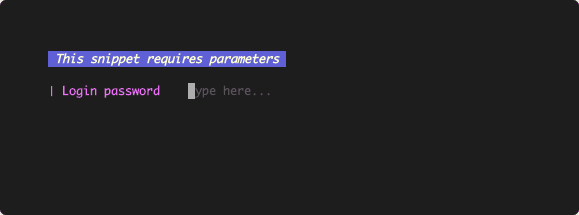

<h1 align="center"> 
  
  
  SnipKit - Snippet CLI manager
</h1>

<h4 align="center">Execute the scripts saved in your favorite snippet manager or generate new scripts with the help of AI without even leaving the terminal.
</h4>

<p>
</p>

<p align="center" style="clear:both">
  <a href="https://go.dev/"></a>
  <a href="https://github.com/lemoony/snipkit/actions/workflows/build.yml"></a>
  <a href="https://opensource.org/licenses/Apache-2.0"></a>
  <a href="https://goreportcard.com/report/github.com/lemoony/snipkit"></a>
  <a href="https://codecov.io/gh/lemoony/snipkit"></a>
</p>

<p align="center">
  
</p>

<p align="center">
  <a href="https://lemoony.github.io/snipkit/">Documentation</a> | <a href="https://github.com/lemoony/snipkit/releases">Changelog</a>
</p>

## Features

- Generate new scripts with the help of SnipKit Assistant
- Load snippets form an external snippet manager (filtered by tags)
  - [SnippetsLab](https://www.renfei.org/snippets-lab/)
  - [Snip](https://github.com/Pictarine/macos-snippets)
  - GitHub Gist ([Example gist](https://gist.github.com/lemoony/4905e7468b8f0a7991d6122d7d09e40d))
  - [Pet](https://github.com/knqyf263/pet)
  - [MassCode](https://masscode.io/)
  - File system directory
- Search for snippets by typing
- Parameter substitution
- Support for different [parameter types](https://lemoony.github.io/snipkit/latest/getting-started/parameters/):
  - Pre-defined values / Enum parameters
  - Password (will be masked)
  - Paths (autocomplete)
- Themes
  - Built-in themes (`default`, `simple`)
  - Define custom themes
- Root command can be adjusted (e.g. set to `print` or `exec`)

Inspired by [Pet](https://github.com/knqyf263/pet).

### SnipKit Assistant

SnipKit Assistant lets you generate parameterized scripts based on a prompt directly from the command line:


### Parameters

SnipKit supports different types of script parameters to ease execution:

| Parameter Type    | Demo                                                                    |
|-------------------|-------------------------------------------------------------------------|
| Predefined values |  |
| Path              |                            |
| Password          |                    |

## Quick Start

Please also have a look at the [Documentation]("https://lemoony.github.io/snipkit/).

### Overview of all commands

```sh
snipkit -h
```
### Configuration

```sh 
# Create a new config
snipkit config init
```

As of now, no external snippet manager is configured.

```sh 
# Add an external snippet manager
snipkit manager add
```

You will be presented with a list of supported managers. Pick the one you want to use. After that, you should be ready to go.

### Working with snippets

Search for and execute a snippet:

```
snipkit exec
```

SnipKit will connect to the external snippet manager configured and provide all corresponding snippets
to you. If you don't want to execute a snippet directly but have a look at the resulting command, call `snipkit print`
instead.

> _Tip_: In order to execute snippets even faster, have a look at the 
> [power setup](https://lemoony.github.io/snipkit/latest/getting-started/power-setup/) described in the documentation.

## Installation

### Homebrew

```bash 
brew install lemoony/tap/snipkit
```

### apt 

```bash 
echo 'deb [trusted=yes] https://apt.fury.io/lemoony/ /' | sudo tee /etc/apt/sources.list.d/snipkit.list
sudo apt update
sudo apt install snipkit
```

### yum

```bash 
echo '[snipkit]
name=Snipkit Private Repo
baseurl=https://yum.fury.io/lemoony/
enabled=1
gpgcheck=0' | sudo tee /etc/yum.repos.d/snipkit.repo
sudo yum install snipkit
```

### deb, rpm and apk packages 

Download the .deb, .rpm or .apk packages from [releases page](https://github.com/lemoony/snipkit/releases) and install 
them with the appropriate tools.


### Go

```bash
go install github.com/lemoony/snipkit@latest
```

### Build

```bash 
git clone https://github.com/lemoony/snipkit.git
cd snipkit 
make build
```

After the build succeeds, go to `./dist` to find the binary for your operating system.

You can also build the project via Gitpod.

[](https://gitpod.io/#https://github.com/lemoony/snipkit)


## Contributing

See [CONTRIBUTING.md](./CONTRIBUTING.md). 

