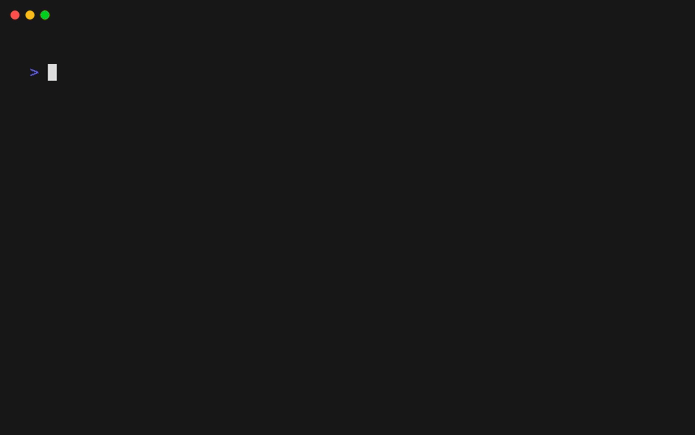

# SnipKit - Snippet CLI manager

[](https://dart.dev)
[](https://github.com/lemoony/snipkit/actions/workflows/build.yml)
[](https://opensource.org/licenses/Apache-2.0)
[](https://goreportcard.com/report/github.com/lemoony/snipkit)
[](https://codecov.io/gh/lemoony/snipkit)

SnipKit aims to paste code snippets from your favorite snippet manager into your terminal without even leaving it.



> This repository is still in the early stages of development! *Use at your own risk.*

As of now, only SnippetsLab is supported. Other CLI managers may be added in the future. 

[Documentation](https://lemoony.github.io/snipkit/)

## Quick Start

#### Overview of all commands

```bash
snipkit -h
```
#### Configuration

```bash 
# Create a new config
snipkit config init
```

If you have SnippetsLab installed, the config should already point to the corresponding
library file. 

You can open & edit the config file easily:

```bash 
snipkit config edit
```

Have a look at the various configuration options. They should be self-explanatory
most of the time.

## Power Setup

### Alias

Always typing the full name `snipkit` in order to open the manager might be too 
cumbersome for you. Just define an alias (e.g. in your `.zshrc` file):

```bash 
# SnipKit alais
sn () {
  snipkit $1
}
```

Then you can just type `sn` instead of `snipkit` to open the app.

### Default Root Command

Most of the time, you want to call the same subcommand, e.g. `print` or `exec`. You
can configure `snipkit` so that this command gets executed by default by editing the config:

*Example:*

```yaml
# snipkit config edit 
defaultRootCommand: "exec"
```

With this setup, calling `sn` will yield the same result as `snipkit exec`. If you want to call
the `print` command instead, just type `sn print`.

## Features

`snipkit` supports the following features:

- Load snippets form an external snippet manager (filtered by tags)
    - SnippetsLab
    - File system directory
- Parameter substitution
- Enum parameters
- Search for snippets by typing
- Root command can be adjusted (e.g. set to `print` or `exec`)
- Themes
    - Built-in themes (`default`, `dracula`, `solarized-light`, `example`)
    - Define custom themes

## Installation

### Homebrew

```bash 
brew install lemoony/tap/snipkit
```

### Go

```bash
go install github.com/lemoony/snipkit@latest
```

### Build

```bash 
https://github.com/lemoony/snipkit.git
cd snipkit 
make build
```

After the build succeeds, go to `./dist` to find the binary for your operating system.


## Features and bugs

Please file feature requests and bugs at the [issue tracker][tracker].

[tracker]: https://github.com/lemoony/snipkit/issues
