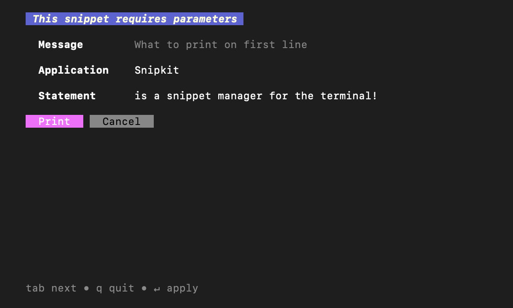

# Themes

SnipKit supports built-in themes as well as the possibility to define your own custom themes.

In order to pick a different theme, edit the [configuration][configuration]:

```yaml title="config.yaml"
version: 1.0.0
config:
  style:
    theme: simple
```

Themes may have different variants for light & dark backgrounds, depending on your terminal.

!!! warning "Enforce light or dark theme"
    Sometimes SnipKit is not able to detect if you're using a light or dark background correctly. You can force a specific
    theme variant by explicitly defining the `.light` or `.dark` suffix, e.g., `default.light` or `default.dark` as
    theme name in your `config.yaml`.

## Built-in themes

As of now, the following themes are supported:

### Default Theme

#### Dark

{ align=left, width=49% }
{ align=right, width=49% }

#### Light

{ align=left, width=49% }
{ align=right, width=49% }

### Simple Theme

{ align=left, width=49% }
{ align=right, width=49% }

## Custom themes

Custom themes should be placed in the directory `<snipkit_home>/themes/`,
`<snipkit_home>` referring to the directory where your [configuration][configuration] lives.

A theme called `custom-theme` should be put into a file named `custom-theme.yaml`. The contents are as follows:

```yaml title="custom-theme.yaml"
version: 1.0.0
variables:
  white: "#FFFFFF"
  black: "#000000"
  red: "#ED6A5A"
  green: "#44AF69"
  yellow: "#FCAB10"
  brown: "#3A3335"
  gray: "#8A8A8A"
  lightGray: "#DDDADA"
theme:
  borderColor: ${gray}
  borderTitleColor: ${gray}
  previewColorSchemeName: "pastie"
  textColor: "" # if empty the default terminal foreground color will be used
  subduedColor: ${gray}
  subduedContrastColor: ${black}
  verySubduedColor: ${lightGray}
  verySubduedContrastColor: ${black}
  activeColor: ${red} #
  activeContrastColor: ${white}
  titleColor: ${brown}
  titleContrastColor: ${white}
  highlightColor: ${green}
  highlightContrastColor: ${black}
  infoColor: ${yellow}
  infoContrastColor: ${white}
  snippetColor: ${lightGray}
  snippetContrastColor: ${black}
```

!!! tip "Example themes"
    You can have a look at the [built-in themes](https://github.com/lemoony/snipkit/tree/main/themes) for some examples.

!!! tip "Dark & Light themes"
    You can define themes differently for light & dark terminal backgrounds. Just add the suffix `.light.yaml` 
    respectively `.dark.yaml` to the filename (e.g., `example-theme.light.yaml`). 
    SnipKit will pick the appropriate theme automatically. 

### Variables

The usage of variables in the theme is optional. Variables help you to reuse the same color and, thus,
make the theme more readable. If you don't want to use a variable, just specify the color directly, e.g.:

```yaml
titleColor: "#FF0000"
```

### Supported colors

You can either use the hex value or an ANSI code to specify a color, e.g.: `#c0c0c0` or `7` for a light-gray color.

!!! info "Implementation detail"
    The underlying library used for the colors is [termenv](https://github.com/muesli/termenv). 
    The [Readme](https://github.com/muesli/termenv#color-chart) gives a good overview of available ANSI colors.

[configuration]: overview.md
