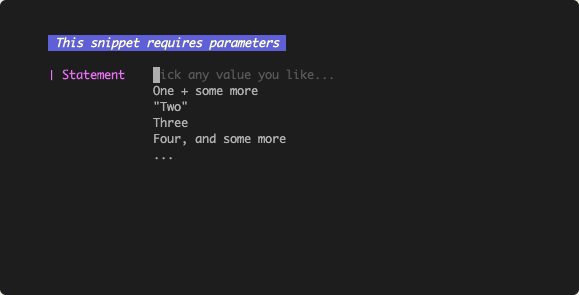
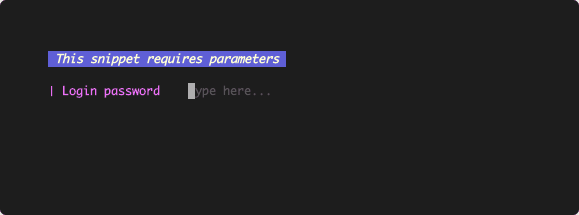
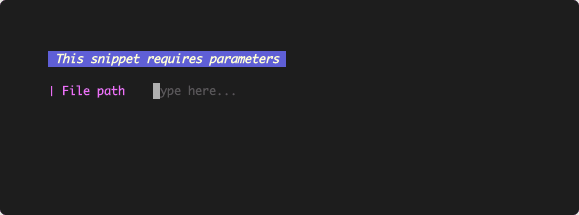

# Parameters

In order to support snippet parameters, SnipKit requires some special parameter syntax in your scripts.

!!! info 
    The good thing about the parameter syntax used by SnipKit is that your scripts remain fully functional even when not
    executed via SnipKit. All parameter information is described by the usage of comments and, thus, can be regarded as a
    consistent way to document your scripts.

## Parameter Names & Descriptions

```sh linenums="1" title="Example snippet"
# some comment
# ${VAR1} Name: First Output
# ${VAR1} Description: What to print on the terminal first
echo "${VAR1}"
```

Each comment which corresponds to a variable starts with `# ${<varName>}` with `<varName>` referring to the variable name
used in your script (e.g., `VAR1` in the example).

- Line 1 is ignored by SnipKit since it does not adhere to this pattern.
- Line 2 defines the name of the parameter as displayed by SnipKit when presenting you parameter input form.
- Line 3 describes the usage of the parameter. As of now, the description will be used as a placeholder value for an empty
  parameter input field.
- Line 4 uses the parameter. It does not correspond to the parameter syntax and belongs to your script.

!!! note 
    If you don't specify a parameter name, the name of the variable will be used instead, e.g., `VAR1` in the example.

## Default Values

You can define a default value for each parameter:

```sh linenums="1" title="Example snippet with a parameter default value"
# some comment
# ${VAR1} Default: Hello World!
echo "${VAR1}"
```

This way, the input field for parameter `VAR1` will be automatically filled with `Hello World`.

## Pre-defined values

You can add multiple pre-defined values for a parameter in order to ease filling the input form:

```sh linenums="1" title="Example snippet with pre-defined values for a parameter"
# some comment
# ${VAR1} Values: One + some more, "Two",Three,  ,
# ${VAR1} Values: Four\, and some more, Five
echo "${VAR1}"
```

The example defines the values `One + some more`, `"Two"`, `Three`, `Four, and some more`, and `Five`. Empty pre-defined
values will be omitted.



You can define multiple lines starting with `${<varname>} Values:` to list pre-defined values. The listed values will be
joined by SnipKit. Each value must be seperated by the next via the character `,`.

!!! attention 
    If the value contains a comma itself, it needs to be escaped via `\,`.

## Passwords

A parameter can be marked to be a password. In this case, the actual characters of the input will be masked.

```sh linenums="1" title="Example snippet with a PASSWORD parameter"
# ${PW} Name: Login password
# ${PW} Type: PASSWORD
login ${PW}
```



Marking the parameter `PW` as password happens in line 2 by defining `Type: PASSWOPRD`.

## Paths

Often, parameters are a path to a file or a directory. In this case, SnipKit is able to provide you with autocomplete
suggestions:

```sh linenums="1" title="Example snippet with a PATH parameters"
# ${FILE} Name: File path
# ${FILE} Type: PATH
git ls-files "${FILE}" | xargs wc -l
```



Marking the parameter `PW` as password happens in line 2 by defining `Type: PASSWOPRD`.

